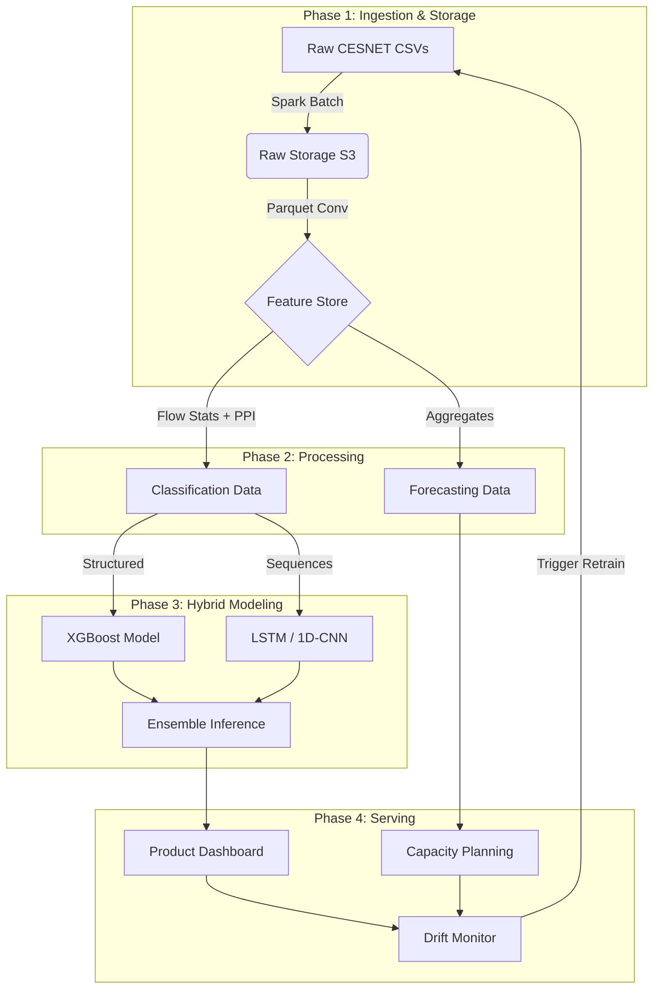

# 📡 Sentinel-Flow: Telco Traffic Intelligence
### Scalable TLS Analysis & Capacity Forecasting


> **Deployment Status:** 🟢 Active | **Data:** CESNET-TLS-Year22 (1 Year Backbone Traffic)

---

## **Executive Summary**
**Sentinel-Flow** is a Big Data ML pipeline designed for **Telecommunication Operators**. It solves the "Encryption Blindness" problem by analyzing **TLS traffic patterns** without decryption. 

By leveraging the [CESNET-TLS-Year22 Dataset](https://zenodo.org/records/10608607), this system identifies emerging services, forecasts network capacity, and detects market shifts using privacy-preserving metadata.

### **Key Objectives**
1.  **Service Classification:** Identify apps (Netflix, Teams, Zoom) from encrypted flows for product analytics.
2.  **Capacity Forecasting:** Predict aggregate bytes/flows per service to optimize provisioning.
3.  **Anomaly Detection:** Discover unknown services or behavioral shifts (Data Drift).

---

## ** System Architecture**

We utilize a decoupled architecture separating **Storage** (S3/HDFS) from **Compute** (Spark/GPU).



## **Data Pipeline (ETL)**
# 1. The Dataset

Source: Nature Scientific Data Paper

Volume: Multi-Terabyte scale, partitioned by Week.

Format: Compressed CSVs containing flow stats, histograms, and PPI (Packet Payload Information).


## **2. Ingestion Strategy (Apache Spark)**

We use PySpark to handle the massive scale of the Year22 dataset.

```
Key Transformations:

Parsing: Extract PPI arrays from string representations.

Imputation: Fill missing TLS_SNI with placeholder tokens; Pad sequences to length 30.

Partitioning: Data is stored in Parquet format, partitioned by Year/Week for fast time-travel querying.

```


## **Python**
```
# Example: PySpark Ingestion Logic
from pyspark.sql import functions as F

def ingest_data(input_path, output_path):
    df = spark.read.csv(input_path, header=True, schema=schema)
    
    # Feature Engineering on the fly
    df_clean = df.withColumn('PPI_Parsed', parse_ppi_udf(F.col('PPI'))) \
                 .withColumn('Week', F.weekofyear(F.col('TIME_FIRST'))) \
                 .fillna({'TLS_SNI': 'UNKNOWN'})

    # Write to Feature Store partitioned by Time
    df_clean.write.partitionBy('Week', 'APP').parquet(output_path)
```


## **Machine Learning Methodology**
We employ a Hybrid Ensemble Approach to maximize accuracy across diverse traffic types.

#### **Model A: The "Sprinter" (XGBoost)**

**Input**: Statistical aggregates (Total Bytes, Duration, Packet Counts, Histogram Bins).

**Why**: Fast training, handles class imbalance via weights, and provides interpretability.

**Target:**: General traffic categorization (Streaming vs. Web).

#### **Model B: The "Deep Diver" (LSTM)**

**Input:** Raw Packet Sequence (PPI) - Size, Direction, and Inter-arrival time of the first 30 packets.

**Why:** Captures the "rhythm" of the traffic. (e.g., A Zoom call has a distinct packet cadence compared to YouTube, even if byte counts are similar).

**Target:** Fine-grained application identification.


## **Performance Strategy**
| Component | Metric | Action |
| :--- | :--- | :--- |
| **Class Imbalance** | High | Use `scale_pos_weight` in **XGBoost** + **SMOTE** for rare apps. |
| **Drift** | Weekly | Monitor **KL-Divergence** on TLS_SNI distributions. |
| **Scaling** | Mixed | **Log-transform** ($log(1+x)$) for Bytes; **Standard Scaling** for Neural Nets. |


## **Implementation**

This section details the necessary environment setup and the commands to run the data downloading and model training pipeline.

---

### 📦 Prerequisites

Ensure you have the following software and libraries installed before proceeding.

* **Python 3.9+** (Recommended for PyTorch and PySpark compatibility)
* **Apache Spark** (Environment configured for cluster mode, e.g., YARN/EMR/Dataproc)
* Required Python packages: `pyspark`, `pytorch`, `xgboost`.

---

### Running the Pipeline

#### 1. Download and Prepare Data

Use the `cesnet-datazoo` API to download and locally partition a sample week of the CESNET-TLS-Year22 dataset.

```bash
# Install the required data handling tool
pip install cesnet-datazoo

# Execute the download script for a sample week (e.g., 2022-01)
python src/download.py --week 2022-01

```

#### Train the Hybrid Model

The final training step involves orchestrating the Tree Model (XGBoost) and the Sequence Model (LSTM/PyTorch) and combining their predictions via a weighted ensemble.

```bash
# Pseudo-code for Hybrid Training Pipeline

# 1. Train Tree Model on structured flow features
params = {'objective': 'multi:softprob', 'eta': 0.05, 'max_depth': 8}
bst = xgboost.train(params, dtrain)

# 2. Train Sequence Model on PPI sequences (requires GPU)
lstm = build_lstm(input_shape=(30, 3)) # (Sequence Length, Feature Dimensions)
lstm.fit(sequence_data, labels)

# 3. Ensemble Predictions (Weighted Average)
# Weights (0.6, 0.4) are determined via validation set optimization.
tree_preds = bst.predict(X)
sequence_preds = lstm.predict(X_seq)

final_pred = (0.6 * tree_preds) + (0.4 * sequence_preds)
```


## **References**
**Dataset:**
I used the [CESNET-TLS-Year22 dataset][cesnet-data] for this project. The paper describing it is available on [Nature Scientific Data][cesnet-data].


[cesnet-data]: https://www.nature.com/articles/s41597-024-03927-4